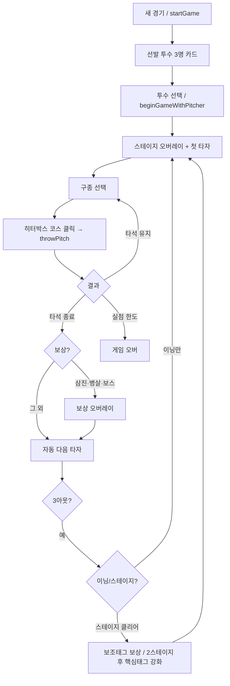

# 마운드 심리전 — 현행 구현 기획서

> 작성 기준: `game.js`(정본 소스) 및 분리 모듈 `js/00-constants.js` ~ `js/03-pitch-progression.js`
> 최종 갱신: **2026-06-01**
> 구 버전 `게임기획서.md`(3이닝·다크 UI)는 폐기. **이 문서가 현재 빌드의 정본**입니다.
> 코드 수정 시: `game.js` 편집 → `node tools/split-game-modules.mjs`(=`npm run split:js`)로 `js/` 재생성.

---

## 1. 게임 개요

| 항목 | 내용 |
|------|------|
| 제목 | 마운드 심리전 |
| 장르 | 웹 야구 / 투수 시점 심리전 / 로그라이크 |
| 플랫폼 | PC 웹 브라우저 (`npm start` → `http://127.0.0.1:4173`) |
| 플레이어 역할 | **투수** (타격·수비 조작 없음) |
| 네임스페이스 | `MountPsycho`(IIFE), classic script |
| 한 줄 소개 | 타자의 숨은 노림수를 읽고 반대로 던져, 3스테이지 로그라이크로 마운드를 지키는 심리전 |

### 핵심 콘셉트

- 타자는 매 타석 **숨겨진 노림수**(강속구 / 변화구 / 느린공 계열)를 가짐.
- 플레이어는 구종·코스 선택과 **승부 기록·타이밍 피드백**으로 노림수를 추리고, **반대 계열**을 던져 유리한 확률을 만듦.
- 같은 패턴을 반복하면 타자 **의심 게이지**가 오르고, 대응력·역노림·거짓 단서가 강해짐.
- 삼진·병살·스테이지 클리어로 **투수 성장(보상)** — 매 경기 조합이 달라짐.

---

## 2. 승리·패배 조건

### 2.1 스테이지 구조 (3단계)

| 스테이지 | 이닝 목표 | 실점 한도 (도달 시 즉시 패배) |
|----------|-----------|-------------------------------|
| 1 | 3이닝 | 5실점 |
| 2 | 5이닝 | 4실점 |
| 3 | 7이닝 | 3실점 |

- 상수: `MP.stageInnings = [3, 5, 7]`, `MP.stageRunLimits = [5, 4, 3]`.
- **스테이지 클리어**: 해당 이닝 수를 모두 수비하고 실점 한도 이하 상태로 마지막 아웃 처리.
- **최종 클리어**: 스테이지 3(7이닝)까지 통과.
- **패배**: 현재 스테이지 실점 한도 도달(`state.runs >= currentStageRunLimit()`).
- 스테이지 클리어 시: 실점·주자·이닝·타순 리셋, 새 라인업 9명 생성, **보조 태그 보상** 3택1.

### 2.1.1 스테이지 테마 시스템

스테이지마다 상대팀 전체에 **테마 1개**가 적용됩니다. 타자 개인 아키타입·보스 기믹은 유지하고, 테마는 공통 보정으로 한 겹 더 얹습니다.

| 스테이지 | 테마 결정 |
|----------|-----------|
| 1 | 랜덤 (쉬운 테마 위주) |
| 2 | 후보 2개 중 선택 (안정 vs 위험) |
| 3 | 후보 3개 중 선택 |

**테마 7종:** 컨택·장타·눈야구·교활·초구공격·참을성·하위반란 (`js/04-stage-theme.js` → `MP.stageThemeCatalog`)

**타자 affinity:** strong 3 / medium 3 / weak 2 / exception 1 — exception은 테마와 반대 성향.

**UI**
- 스테이지 진입: 전체 오버레이(짧게) + 상단 **스테이지 테마 박스**(`#stageThemeBadge`, 새 경기 옆) 클릭 시 상세
- 인게임: topbar 뱃지(넓은 화면) + 우측 **스테이지 테마 카드**
- 스테이지2·3 클리어 후 **다음 상대 선택** — 핵심태그 빌드 궁합 라벨 표시

**보상 연동**
- 스테이지 클리어 보조태그 3택1: 시너지 / **테마 대응** / 위험·약점 보완
- 타석 보상(삼진 등): 현재 테마 대응 stat 후보 추가 가능

**강도:** 스테이지1 70% → 2 100% → 3 120% (`MP.stageThemeStrengthFor`)

### 2.2 야구 규칙 요약

- 3아웃 → 다음 이닝. 카운트 UI는 **원형 점**(B 3개, S/O 각 2개).
- 볼넷, 주자 진루, 득점, 병살, 실책, 안타·2루타·홈런 반영.
- **텍사스 안타**: 완전히 속인 뒤에도 약한 안타가 나올 수 있음(`TEXAS HIT!`).

---

## 3. 화면 단계 (상태 머신)

`state.screenPhase` 값:

| 단계 | 의미 | 투구 입력 |
|------|------|-----------|
| `pitcherSelect` | 선발 투수 3명 중 선택 | 불가 |
| `pitching` | 인게임 수비 | 가능 |
| `reward` | 로그라이크 보상 선택 | 불가 |
| `themeSelect` | 다음 스테이지 테마 선택 | 불가 |
| `transition` | 타석 종료·다음 타자 대기 | 불가 |
| `gameOver` | 경기 종료 | 불가 |

`pitchInputLocked()`가 위 조건 + `waitingNextBatter`, `pendingGameOver`를 묶어 입력을 막음.

---

## 4. 플레이 흐름 (타임라인)



### 4.1 선발 선택 (`startGame`)

- 투수 후보 3명 랜덤 생성, **이름·스타일(프로필 라벨)만** 카드에 표시.
- 상세 스탯·구종·태그는 **선택 후** 인게임에서 공개.
- 포수 타입 1명 랜덤 배정(안정형 / 공격형 / 분석형 / 배짱형) — UI 문구용.

### 4.2 한 타석 (`startAtBat`)

- 타자별 `createPlan()`:
  - **노림수** `target`: `fast` | `breaking` | `offspeed`(가중치 + 직전 타석 기억 반영).
  - **접근** `approach`: 균형 / 적극 / 신중 / 초구 / 보호 등.
  - **의심** 초기값: 보스 +10, 기억 등급, 스테이지 인덱스 반영.
  - **노림수 추천** 미리 계산(`buildRecommendation`).
- B/S/O, 주자, 의심 게이지, 승부 기록 초기화.

### 4.3 한 투구 (`throwPitch`)

1. 구종 ID + 히터박스 셀(존·행·열·스트/볼 의도) 확정.
2. `analyzePitcherPattern()` — 의심·패턴 신호·역노림·볼 의도 분류.
3. `resolvePitch()` — 제구·스윙·컨택·타구 결과 확률 계산.
4. `applyMindGameResult()` — 패턴/거짓단서 문구 병합.
5. 공 애니메이션, `updateRead()`(노림수 추정 점수), `applyPitchResult()`(BSO·주자·실점).
6. `recordPitchPattern()` — 패턴 메모리 저장.

---

## 5. 투수 시스템

### 5.1 능력치 (5종, 대략 18~99)

| 스탯 | 역할 |
|------|------|
| 구속 | 강속구 계열 구위·표시 구속(km/h) |
| 제구 | 스트라이크 의도 시 존 안착, 볼넷·실투 억제 |
| 변화 | 변화구·느린공 계열 위력 |
| 멘탈 | 주자·위기 시 제구 흔들림 완화 |
| 예측 | **노림수 추천** 정확도 |

### 5.2 프로필 (선발 시 랜덤)

| ID | 라벨 | 구종 성향 |
|----|------|-----------|
| power | 파워 피처 | 강속구 2종 + 변화/느린공 1 |
| breaking | 변화구 장인 | 4~5종, 슬라이더·커브 중심 |
| command | 제구형 | 3~4종, 안정적 구성 |
| balanced | 균형형 | 3~4종, 랜덤 풀 |

**필수 규칙**

- 강속구 계열(포심/투심/싱커 중 1) **1개 이상**.
- 변화구 또는 느린공 계열 **1개 이상**.
- 최대 **5구종**.

### 5.3 구종 목록 (`MP.pitchLibrary`)

| ID | 이름 | 계열 | speed | movement | control | cost | 비고 |
|----|------|------|-------|----------|---------|------|------|
| four | 포심 | fast | 92 | 28 | 76 | 5 | 정면 승부 |
| two | 투심 | fast | 86 | 52 | 68 | 5 | 땅볼 유도 |
| sinker | 싱커 | fast | 84 | 74 | 62 | 6 | 낮은 땅볼 유도 |
| cutter | 커터 | fast | 82 | 62 | 70 | 6 | 빗맞힘 유도 |
| slider | 슬라이더 | breaking | 72 | 86 | 58 | 7 | 헛스윙 유도 |
| curve | 커브 | breaking | 56 | 92 | 50 | 7 | 타이밍 교란 |
| change | 체인지업 | offspeed | 48 | 66 | 62 | 6 | 직구 노림 저격 |
| splitter | 스플리터 | offspeed | 64 | 80 | 46 | 8 | 낙차 큰 승부구 |

- 표시 구속: 기준값 + 구속 스탯 + 구종별 보정.
- `cost`(구종 코스트)는 데이터로만 존재 — 현재 경기 루프에서 자원 소모로 강하게 작동하지 않음(8장 참조).

### 5.4 투수 태그 — 3계층

태그는 카드에서 **핵심 / 보조 / 약점** 세 섹션으로 표시되며, 칩을 클릭하면 **그 섹션 바로 아래**에 설명이 인라인으로 펼쳐짐(`showPitcherTagDetail`).

#### (A) 핵심 태그 — 투수 정체성 1개 (`coreTagCatalog`, 12종 / 6계열)

- 선발 프로필에 따라 1개 자동 배정(`coreTagForProfile`): 프로필 후보군 중 랜덤, `pitcher.coreTagId`·`baseTags`에 저장.
- **런 중 추가/교체 없음.** 스테이지 2 클리어 후 **핵심진화 1회**(`coreEvolutionId`) — 핵심 칩 아래 별도 진화 칩으로 표시.
- 이름은 KBO 감성으로 ≤6자 단축(id는 불변). 설명은 **"언제 / 무엇이 / 얼마나"**가 드러나는 문장(B안).

| id | 이름 | 계열 | 핵심 효과(요약) | 등장 프로필 |
|----|------|------|-----------------|-------------|
| core_high_fastballer | 하이볼러 | 삼진계 | 높은 코스 강속구 구위·헛스윙↑, 강속구 위력↑ | power, command |
| core_breaking_maestro | 마구장인 | 삼진계 | 변화구 구위 대폭↑, 결정구 헛스윙↑ | breaking |
| core_finisher_collector | 필살구 | 삼진계 | 2스트 결정구 구위↑, 정타 확률↓ | power, breaking |
| core_groundball_architect | 땅볼설계 | 땅볼계 | 낮은 코스 땅볼↑, 낮은 타구 위력↓ | breaking, command |
| core_cutter_softcontact | 정타봉쇄 | 땅볼계 | 커터·투심 몸쪽/낮은 코스 정타 억제 | command, power |
| core_corner_artist | 칼제구 | 제구계 | 스트존·바깥 코너 제구 정밀화 | command, balanced |
| core_first_pitch_pressure | 기선제압 | 제구계 | 초구 제구·구위↑, 초구 스트 선점 | power, balanced |
| core_bait_designer | 낚시꾼 | 심리계 | 유인·낚시 볼 헛스윙↑, 의심↑ | breaking, balanced |
| core_counter_pitcher | 수싸움 | 심리계 | 역노림 시 타구 위력 대폭↓, 의심↑ | command, breaking |
| core_clutch_pitcher | 강심장 | 멘탈/운영계 | 위기 압박↓, 풀카운트 제구 안정 | balanced, command |
| core_game_manager | 판짜기 | 멘탈/운영계 | 동점 카운트 구위↑, 풀카운트 볼넷↓, 압박↓ | balanced, command |

> 6계열: **삼진계 / 땅볼계 / 제구계 / 완급계 / 심리계 / 멘탈·운영계**. (완급계 핵심태그 `완급지배`는 카탈로그에 정의되어 있으며 보조/강화에서 계열로 활용됨.)

#### (B) 보조 태그 (`pitcherTagCatalog` type=`bonus`)

- **스테이지 클리어 시 3택1**(중복 없음). **개수 상한 없음** — 12종 전부 모으면 `supportUpgrade`(강화) 보상.
- 2스트 특화, 낮은 코스 장인, 헛스윙 유도, 땅볼 유도, 멘탈 회복, 초구 강세, 패턴 셔플러, 약타 억제 등.
- 각 보조태그는 `supportTagMeta`로 **계열·약점상쇄·역상성 계열**이 정의되어, 보상 풀이 핵심태그 계열과 시너지/리스크를 따져 구성됨(10장).

#### (C) 약점 태그 (`type=weakness`, 숨김 → 조건 공개)

| 약점 | 공개 조건 |
|------|-----------|
| 장타 위험(homerun_risk) | 홈런 허용 |
| 볼넷 위험(walk_risk) | 볼넷 2회 이상 |
| 풀카운트 불안(full_count_wobble) | 풀카운트 3회 이상 |
| 위기 흔들림(pressure_wobble) | 연속 출루 2회 |

- 선발 시 약점 2개 랜덤 부여, 조건 충족 시 카드에 공개.

---

## 6. 타자 시스템

### 6.1 능력치 (5종)

| 스탯 | 역할 |
|------|------|
| 컨택 | 맞히기·범타 |
| 파워 | 장타·홈런 |
| 선구 | 볼 참기·체이스 억제 |
| 주력 | 안타 품질 |
| 예측 | 노림 맞을 때 타이밍 유리 |

### 6.2 타순 아키타입

| 타순 | 유형 | 성향 |
|------|------|------|
| 1~2 | 출루형 | 컨택·선구·주력 높음 |
| 3~4 | 중심형 | 파워·예측 높음 |
| 5~6 | 장타형 | 파워 위주, 약점 존재 |
| 7~9 | 하위형 | 전반 낮음, 변칙 가능 |

### 6.3 보스 타자

- 매 스테이지 라인업 **9명 중 1명** 랜덤 슬롯이 보스.
- 스탯 추가 보정 + 전용 기믹 1개:

| 기믹 | 효과 요약 |
|------|-----------|
| 홈런왕 | 실투(중앙) 시 장타 위험 극대 |
| 커트장인 | 2스트 파울↑ |
| 천재타자 | 패턴·역노림·기억력↑ |
| 눈야구 | 볼 유도에 강함 |
| 클러치 | 주자 있을 때 강화 |

### 6.4 타자 마음·성향 (UI 태그)

- **마음 유형**(`batterMindTypes`): 정직형 / 교활형 / 적응형 / 도박형 — 반응 신뢰도·거짓단서·역노림·한방 성향.
- **숨은 성향**(`hiddenTendencies`): 초구형 / 인내형 / 안구형 / 응징형 / 즉응형 — 접근·스윙·파울 보정.
- **기억 등급**(`memoryGrades`): 낮음~천재형 — 직전 투구 기억 span, 의심 초기값.

---

## 7. 투구 UI — 히터박스

### 7.1 조작

1. **구종 버튼** 또는 키 **1~5**(보유 구종 수만큼).
2. **5×5 히터박스** 클릭:
   - 가운데 **3×3**: 스트라이크 의도(`data-intent="strike"`).
   - **바깥 링**: 볼 유도(`data-intent="ball"`).
3. 별도 스트/볼 버튼은 비활성(히터박스만 사용).

### 7.2 제구·실제 코스

- 클릭한 **의도**와 **제구 스탯**으로 실제 행/열 결정(`resolvePitchLocation`).
- 스트라이크 의도도 제구 실패 시 **볼** 가능, 볼 의도도 몰리면 **스트라이크** 가능.
- **연속 볼 2개 이상** 후 스트라이크 의도 시 일정 확률 존 복구 보정.
- 고른 칸과 다른 곳에 가면 **마커만** 실제 위치 표시.

### 7.3 볼 유도 내부 분류 (`ballIntentPlans`)

| ID | 라벨 | 효과 요약 |
|----|------|-----------|
| fishing | 낚시 볼 | 헛스윙·체이스↑ |
| show | 보여주기 볼 | 다음 공 체감 변화 |
| waste | 버리는 볼 | 반응 확인·read 정보 |
| brush | 위협구 | 몸쪽 의식 |

바깥 존 클릭 시 자동 분류(`classifyBallIntent`).

---

## 8. 투구 판정 파이프라인

```
제구(위치) → 스윙 여부 → (스윙 시) 타이밍 → 컨택 → 파울/인플레이 → 안타·아웃·병살·실책
```

### 8.1 스윙 확률 (요약)

- 존 안 기본 ≈46%, 밖 ≈16%.
- 노림 일치 +20%, 불일치 −9%.
- 접근(적극/신중/초구/보호)·카운트·구종 특수·태그·**의심/패턴 노출**·볼 플랜 보정.

### 8.2 스윙 없음

- 존 안 → **루킹 스트라이크**, 존 밖 → **볼**.

### 8.3 스윙 후

- **타이밍** 0~1 → 라벨: 완벽 / 좋음 / 불안정 / 늦음 / 너무 빠름 / 밀림 / 완전히 속음.
- 컨택 실패 → **헛스윙 삼진**.
- 컨택 성공 + 타이밍 낮음 → **파울**(2스트 전 S+1).
- 인플레이 → `contactQuality`로 단타·2루타·홈런·땅볼·병살·실책·**텍사스 안타** 분기.

### 8.4 노림수 일치(`targetMatch`) 영향

- **일치**: 스윙↑, 타이밍↑, 장타 위험↑.
- **불일치**: 헛스윙·속임 단서↑, 장타 위험↓(텍사스 안타 등 변수 존재).

### 8.5 같은 구종 반복

- 동일 **계열** 연속 투구 시 `repeatedPenalty` — 타자 유리.

---

## 9. 심리전 시스템

### 9.1 노림수 추정 (`readScores`)

- 타석마다 fast / breaking / offspeed 점수. 스윙·타이밍·파울·볼 반응으로 가감(`updateRead`).
- **거짓 단서**(`falseClue`) 발생 시 잘못된 계열 점수↑.

### 9.2 의심 게이지 (`suspicion` 0~100)

- **상승 신호**: 같은 구종/계열/코스/의도 반복, 카운트·주자별 동일 선택, 배합 순서 노출.
- **효과**: 58+ & 신호 → `exposed`(패턴 노출); 72+ & 교활/적응/도박 → `reverseRead`(역노림). 노출 시 스윙·컨택·파울·장타 보정↑.

### 9.3 노림수 추천 UI

- 투수 **예측** 스탯 기반으로 실제 노림수 적중 확률 계산 → 맞추면 **반대 계열** 구종 추천(`counterCategoryForTarget`).
- **보유 구종만** 추천(`representativePitchName`). 교활형 + 의심 70+ 시 추천 정확도 패널티.

### 9.4 직전 타석 기억 (`lastAtBatMemory`)

- 삼진/병살/안타 유형에 따라 다음 타자 노림 가중치 조정.

### 9.5 포수·카운트 심리 카드

- UI에 포수 톤, 카운트별 심리 문구(`currentCountPsychCard`, `currentCatcherSign`).

---

## 10. 보상 시스템

타석 종료 연출 후 보상 → (스테이지 클리어면) 스테이지 진입 연출 순. 보상은 **3택1**.

### 10.1 발생 조건 / 보상 종류 (`state.rewardKind`)

| kind | 트리거 | 내용 |
|------|--------|------|
| `normal` | 스윙삼진 / 루킹삼진 / 병살 / 보스 제압 | 스탯·구종 숙련·신규 구종 풀에서 3택1 |
| `stageTag` | 스테이지 클리어 | **보조 태그** 3택1 |
| `coreEvolution` | **스테이지 2 클리어 1회** | **핵심진화** 3택1 (이후 stageTag 연속 제공) |

- 강도: 병살 = 최대(추가 풀), 보스 = 보스 보너스 풀, 루킹 > 스윙.

### 10.2 일반 보상 (`generateRewardChoices`)

- 스탯 +1~2(제구/구속/변화/멘탈/예측).
- 직전 사용 구종 **제구 +3~5**(`type:"pitch"` 숙련).
- 레퍼토리 5개 미만 시 **신규 구종** 추가(`type:"newPitch"`).
- 병살·보스 reason이면 관련 스탯 후보 가산.

### 10.3 보조 태그 보상 (`generateStageTagChoices`)

- 후보 3장을 **의도적으로 구성**: ① 핵심태그 계열 시너지, ② 현재 공개된 약점 상쇄, ③ 역상성/리스크(또는 랜덤). `supportTagMeta`의 family·countersWeakness·oppositeFamilies 사용.

### 10.4 핵심진화 보상 (`generateCoreEvolutionChoices`, `coreEvolutionCatalog`)

- **스테이지 2 클리어 1회**, 현재 `coreTagId`에 연결된 진화 카드 풀(12핵심 × 5장)에서 **3택1**.
- 핵심태그 추가/교체 없음 — `pitcher.coreEvolutionId` 별도 슬롯 1개.
- 후보 구성: 패턴 A~E(정석/연계/약점보완/운영/리스크/심리/숙련/스테이지/부담) 중 랜덤 1세트로 3장 선정.
- 보상 UI: 카드명 + `{핵심} 진화` 서브타이틀, **조건/효과/운영** 3행, 하단 뱃지 없음, **클릭 선택 → 확인 버튼** 확정.
- 예시 카드명: 상단압박(하이볼러), 승부수(강심장), 흐름전환(판짜기).

---

## 11. 구종 부담·숙련·레벨업 시스템 (**메인 루프 연동 완료, 2026-06-01**)

> ✅ `js/03-pitch-progression.js`의 부담/숙련/레벨 처리가 메인 루프(`throwPitch`·`finishAtBat`·`addOut`·`advanceStage`·보상 생성)에 연결됨. 투구 해석(`resolvePitch`)에 부담 보정과 레벨 효과가 반영되고, 보상창에 구종 레벨업 카드가 등장함.
> 연동 시 발견·수정한 모듈 버그 2건: `roleBonus()` 반환 누락(숙련치 NaN화) / `pickWeightedPitchUpgrades()` 중복검사 오류(보상 생성 예외). 둘 다 수정 완료.

### 11.1 부담도 (burden, 0~100) — `pitchBurdenConfig`

- 같은 공 연투·2스트·풀카운트·보스 상대 시 누적, 다른 구종/타석/이닝/스테이지에 회복.
- 단계: **안정(0~24) → 부담(25~49) → 과부하(50~74) → 한계(75~100)**.
- 단계별 페널티: 제구↓(0/2/5/8), 실투↑, 피홈런↑(과부하·한계), 헛스윙↓.
- 연동: `resolvePitch`에서 `getBurdenModifiers(pitch)`로 quality(제구)·contact·contactQuality(피홈런)에 반영. 투구 버튼 하단 **부담 막대**(색상=단계)로 표시.

### 11.2 숙련도 (stageMastery / runMastery) — `pitchMasteryConfig`

- 좋은 결과(루킹/헛스윙/약한 타구/삼진/병살 등)에 점수, **카운트·주자·타자·연투·부담** 배율 적용. 구종다운 활약(`roleBonus`)에 추가 가산.
- 같은 공만 연투하면 `repeatGain` 배율로 획득 점수가 급감(1.0→0.8→0.55→0.3) → 섞어 던질수록 효율↑.
- stageMastery는 스테이지마다 리셋, runMastery는 경기 내내 누적.
- 연동: 매 투구 `processPitchProgressionAfterPitch`, 타석 종료 `processPitchProgressionAtBatEnd`(삼진/병살/보스 마무리 보너스).

### 11.3 레벨 (Lv.1~5) — `pitchLevelNames` / `pitchLevelEffect`

- 숙련이 쌓이면 **보상창에 구종 레벨업 카드** 등장(가중치 = 숙련 구간 ×1~3.5 + runMastery 보너스 + 삼진/병살/보스 reason 가산).
- 게이트: Lv4는 stageMastery ≥40, Lv5는 ≥70 **+ 보스 격파 해금**(`bossUpgradeUnlocked`, 보스 아웃 시 `noteBossUpgradeUnlock`).
- 레벨별 구종 고유 효과(구위·헛스윙·병살 등). 적용은 `mergePitchLevelEffect`로 `resolvePitch`에 합산.

---

## 12. UI·피드백

### 12.1 레이아웃 (밝은 카드 톤, Card V2)

| 영역 | 내용 |
|------|------|
| 상단 | 이닝 / 실점 / 실점 한도, B·S·O 원형, 주자 다이아 |
| 왼쪽 | 투수 카드(접기·상세, `.card-v2`), 구종 버튼, 히터박스 |
| 중앙 | 타자·존·공 궤적·타이밍 배지 |
| 오른쪽 | 타자 카드, 의심 게이지, 노림수 추정 바, 승부 기록, 추천 |

- 투수 카드 태그 설명은 **섹션 인라인**으로 펼쳐짐(보조/약점 섹션 간격 16px).
- 보상 카드 텍스트는 **중앙 정렬**로 통일.

### 12.2 주요 연출

- 큰 결과 배너: STRIKE OUT / HOME RUN / DOUBLE PLAY / WALK / TEXAS HIT 등.
- 안타·홈런 후 **게임 오버 지연**(결과 읽을 시간).
- 보스 등장 2줄 배너, NEXT BATTER / INNING CHANGE / STAGE 오버레이.
- 히터박스·카드 위치 **고정**(오버레이가 레이아웃을 밀지 않음).

### 12.3 승부 기록 형식

- `이번 타자 n구 · {코스 자연어}`(번호 없음), 구속 km/h, 타이밍·결과 문장, 타석 종료 시 노림수 공개.

---

## 13. 기술·운영 (개발 참고)

| 항목 | 경로 / 명령 |
|------|-------------|
| 정본 소스 | `game.js`(모놀리식) |
| 분리 산출물 | `js/00-constants.js` → `01-state.js` → `02-game-core.js` |
| 직접 관리 모듈 | `js/03-pitch-progression.js`(split 대상 아님) |
| 로드 순서 | constants → state → 03-progression → core |
| 분리 재생성 | `node tools/split-game-modules.mjs`(=`npm run split:js`) |
| 실행 | `npm start` → `http://127.0.0.1:4173` |
| 테스트 콘솔 | `http://127.0.0.1:4173/test.html`(postMessage 브리지 `mount-psycho-test`; `file://` 직접 열기 금지) |
| 스타일 캐시 | `index.html`의 `styles.css?v=...` / `js/*.js?v=...` 갱신 + 강력 새로고침 |
| 롤백 | `game.monolith.js` |
| 가이드 | `STABILITY.md` |

### 13.1 배포

- 배포본: `web-deploy/mount-psycho-baseball/`(정적 호스팅용, `js/` 모듈 로드).
- **동기화(2026-06-01 완료)**: 소스의 `index.html`·`styles.css`·`game.js`·`js/*.js`를 배포로 복사, 캐시 버전 `v=20260601-coredesc`로 통일, 잔여 루트 스크립트 정리.
- 소스 변경 시 배포 동기화 + 캐시 버전 갱신 필요.

---

## 14. 밸런스 철학 (설계 의도)

- 100% 맞히기 게임이 아님 — 좋은 선택은 확률을 크게, 나쁜 선택은 장타·볼넷 위험.
- 야구답게 **변수**는 남김(제구 흔들림, 텍사스 안타, 거짓 단서).
- 반복 패턴은 **처벌** — 섞을수록 의심↓·대응 완화.
- 보상은 **잘 던진 결과**에 연동(병살 > 루킹 > 스윙삼). 핵심태그 → 보조태그 시너지로 빌드 방향성 부여.

---

## 15. 향후 확장 후보 (미구현·약함)

- 구종 코스트(`cost`) 기반 자원/체력 루프 강화.
- 부담/숙련 밸런스 튜닝(연동 직후라 수치 조정 여지 큼) 및 부담·숙련·레벨 상세 UI(투수 카드 패널).
- 모바일 터치·레이아웃 재검수.
- 타구 방향 연출·구종별 궤적 차별화.
- 확률 미리보기 UI.

---

*구현 변경 시 `game.js` 수정 → `npm run split:js`로 동기화하고, 본 문서·배포본도 함께 갱신할 것.*
